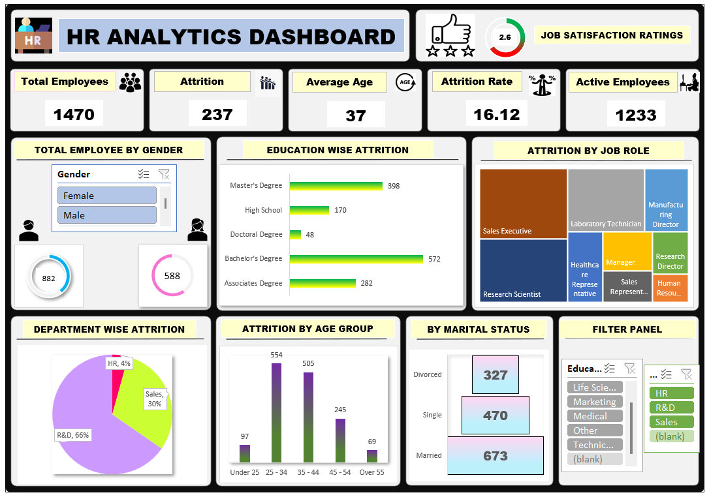

# 📊 HR_Data_Analysis_Excel

## 🔍 Problem Statement

Employee attrition is a critical challenge that impacts organizational performance, increases hiring costs, and disrupts team productivity. This project aims to analyze employee attrition patterns across various dimensions such as department, marital status, education level, age group, job role, gender, performance ratings, and key performance indicators (KPIs).

Using Excel for data analysis and visualization, the objective is to identify key factors contributing to employee turnover, uncover high-risk groups, and highlight trends that influence retention. The analysis seeks to provide actionable insights that can help HR teams make data-driven decisions to improve employee satisfaction, optimize workforce planning, and reduce attrition rates.

---

## 🎯 Objective

* Understand key metrics and trends
* Perform data cleaning and transformation
* Generate actionable insights

---

## 🛠️ Tools & Technologies

* Excel - Pivot Table,

---

## 📁 Dataset

* Source: (Kaggle)
* Size: (e.g., 1471 rows, 44 columns)
* Description: The dataset contains comprehensive information on employee attrition within an organization, focusing on HR-related insights. It includes demographic, professional, and performance-related attributes to help analyze the factors influencing employee turnover.

---

## 🔧 Process / Steps

1. Data Cleaning (handling nulls, duplicates)
2. Data Transformation (joins, aggregations)
3. Exploratory Data Analysis (EDA)
4. Visualization *(if applicable)*

---

## 📊 Key Analysis / Queries

Highlight important SQL queries or steps:

* Top 5 states with highest voter turnout
* Party-wise vote share analysis
* Winning margin by region

---

## 📈 Key Insights

* Region X had the highest voter turnout
* Party A dominated urban areas
* Close contests observed in swing states

---

## 📊 Dashboard / Visualization

---

## 🚀 Outcome

Explain impact:
Example: Identified voting trends and patterns that can help in campaign strategy and decision-making.

---

## 📌 Future Improvements

* Add predictive modeling
* Build interactive dashboard
* Automate data pipeline

---

## 🙋‍♂️ Author

THE DATADLINE
GitHub
